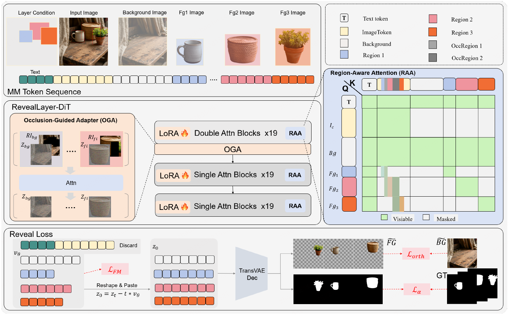
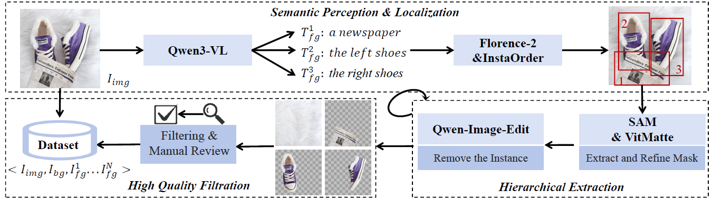

<div align="center">

<div style="text-align: center;">
    
    <h2>Disentangling Hidden and Visible Layers via Occlusion-Aware Image Decomposition</h2>
</div>

<div>
  <strong>
  Binhao Wang<sup>1,2,*</sup>,&nbsp;
  Shihao Zhao<sup>1,2,*</sup>,&nbsp;
  Bo Cheng<sup>2,*,†</sup>,&nbsp;
  Qiuyu Ji<sup>1,2</sup>,&nbsp;
  Yuhang Ma<sup>2</sup>,<br>
  Liebucha Wu<sup>2</sup>,&nbsp;
  Shanyuan Liu<sup>2</sup>,&nbsp;
  Dawei Leng<sup>2,‡</sup>,&nbsp;
  Yuhui Yin<sup>2</sup>
  </strong>
</div>

<div>
  <sup>1</sup>Wenzhou University&nbsp;&nbsp;&nbsp;
  <sup>2</sup>360 AI Research
</div>

<div>
  <sup>*</sup> Equal Contribution. &nbsp;
  <sup>†</sup> Project Lead. &nbsp;
  <sup>‡</sup> Corresponding Author.
</div>

<br>

<div>
  <h3>🔥 Accepted by ICML 2026!</h3>
</div>

<div>
  <a href="https://zhao0100.github.io/RevealLayer/" target="_blank">
    
  </a>
  &ensp;
  <a href="https://arxiv.org/abs/2605.11818" target="_blank">
    
  </a>
  &ensp;
  <a href="https://huggingface.co/datasets/qihoo360/RevealLayer-100K" target="_blank">
    
  </a>
  &ensp;
  <a href="https://huggingface.co/qihoo360/RevealLayer" target="_blank">
    
  </a>
  &ensp;
  <a href="https://research.360.cn/products/Reveal-Layer" target="_blank">
    
  </a>
</div>

<br>

<strong>
RevealLayer decomposes an RGB image into multiple RGBA layers, enabling precise layer separation and reliable recovery of occluded content in natural scenes.
</strong>

<br><br>

<div style="width: 100%; text-align: center; margin: auto;">
    
</div>

For more visual results, go checkout our <a href="https://zhao0100.github.io/RevealLayer/" target="_blank">project page</a>.

---

</div>

## ⭐ Update

- **[2026.09]** 🔥 **Training code released.** This repository now contains the full training pipeline
  of RevealLayer — two-stage training, validation, and diagnostics — retargeted to
  **FLUX.1-Kontext-dev** as the base model.
  - The initial release shipped **inference code only** (no training code), and the model was trained on **FLUX.1-dev**.
  - This release adds the training code, switches the base model to **FLUX.1-Kontext-dev**, and adds a
    validate-before-you-spend-8-GPUs workflow.
  - 📄 中文训练说明: [TRAINING.md](TRAINING.md) (detailed Chinese manual), 快速上手: `bash train_full.sh`.
- **[2026.06]** 🔥🔥 [RevealLayer V2](https://research.360.cn/products/Reveal-Layer) is now available with improved performance.
- **[2026.05]** We released the RevealLayer checkpoint on [Hugging Face](https://huggingface.co/qihoo360/RevealLayer).
- **[2026.05]** We released the RevealLayer paper and inference code.

### ✅ TODO

- [ ] Release RevealLayer-100K and RevealLayerBench.
- [ ] Release the RevealLayer checkpoint trained on FLUX.1-Kontext-dev.
- [ ] Release an improved version of RevealLayer with stronger layer consistency and higher inference efficiency.

> **Note on base models.** The checkpoint currently hosted on
> [Hugging Face](https://huggingface.co/qihoo360/RevealLayer) comes from the first release and pairs with
> **FLUX.1-dev**. The training, validation and single-image inference code in this repository targets
> **FLUX.1-Kontext-dev**; always pass `--pretrained_model_name_or_path` pointing at the base model your
> checkpoint was trained with.

---

## 🎃 Overview

RevealLayer focuses on occlusion-aware image layer decomposition, recovering visible and hidden RGBA layers from a single RGB image with region guidance.

<div style="width: 100%; text-align: center; margin: auto;">
    
</div>

The method adapts a rectified-flow image transformer with a multi-layer token concatenation scheme and
3D-RoPE position encoding, so that an arbitrary number of layers can be decoded in one pass. Training
fine-tunes the transformer with LoRA while keeping the text encoders frozen, and supervises the alpha
channel through a **transparent decoder** (`transparent_decoder_ckpt.pth`) with a hard-constraint alpha
loss plus a soft-constraint orthogonality loss between layers.

---

## 📁 Repository structure

| Path | Purpose |
|---|---|
| `train.py` | Training entry point (Accelerate + DeepSpeed-free `torchrun`); CLI-parsed, config-driven |
| `train.sh` | **Two-stage training driver**: `stage1 → validate → stage2` (recommended entry) |
| `train_full.sh` | One-liner shortcut for a full stage-2 run on 8 GPUs / 100k steps (`nohup`) |
| `validate.py` | Validation inference: PSNR / SSIM against the reference background, PASS/FAIL verdict |
| `validate.sh` | Example validation invocation on a 30k-step checkpoint |
| `infer_single.py` | Single-image inference: one RGB image + boxes → RGBA layers / composite / background |
| `infer.py` | Manifest-driven batch inference plus the shared pipeline used by `infer_single.py` and `validate.py` (LoRA / `layer_pe` / `Refiner` loading, custom transformer+VAE+pipeline assembly, bbox filtering and resize geometry); supports `--tols/--cid` slicing across GPUs |
| `dataset.py` | Dataset that assembles multi-layer targets, bboxes and the transparency targets |
| `models/` | Model-side code: `adapter.py`, `custom_model_mmdit.py`, `custom_model_xvae.py`, `custom_pipeline.py`, `lora_utils.py` |
| `configs/` | `base.py` (shared settings), `kontext_train_1024.py` (the 1024px Kontext training config), `ld_resolution1024_test.py` (test config) |
| `prepare_subset.py` | Samples a small training/validation subset and copies the referenced images |
| `convert_checkpoint.py` | Normalizes LoRA keys / splits `extra_modules.pt` so `infer.py` can load a raw training checkpoint |
| `check_lora.py`, `check_lora_inference.py` | Diagnostics: which modules the LoRA covers, and whether it actually changes the attention weights |
| `inspect_transformer.py` | Lists every `nn.Linear` path in the transformer — use it to verify LoRA `target_modules` |
| `diag_latent.py`, `diag_traindist.py`, `diag_transpvae.py` | Latent / training-distribution / transparent-VAE diagnostics |
| `download_data.sh` | Downloads RevealLayer-100K and the base models into `data/` and `models/` |
| `diffusers/` | Vendored, patched `diffusers` — **must be installed from source** (see below) |
| `benchmark/` | RevealLayerBench metadata |

---

## 🔧 Quick Start

### 0. Experimental environment

We tested our training and inference code with Python 3.10, PyTorch 2.7.1 and CUDA GPUs.
Training the full model takes **8 GPUs** with the default recipe (global batch size 8).

### 1. Setup repository and environment

```bash
git clone https://github.com/zqlsnr/revealayer-kontext-train.git
cd revealayer-kontext-train

conda create -n reveallayer python=3.10
conda activate reveallayer

pip install -r requirements.txt

pip install flash-attn --no-build-isolation

# RevealLayer patches diffusers — install the vendored copy, not the PyPI one
cd diffusers
pip install .
cd ..
```

Recommended for training: `pip install prodigyopt` (the recipe uses the Prodigy optimizer).

---

## 📦 Prepare the models

Model files are hosted with Git LFS, so please enable Git LFS before cloning model repositories.

```bash
git lfs install
```

Download the base model used for training (**FLUX.1-Kontext-dev**):

```bash
git clone https://huggingface.co/black-forest-labs/FLUX.1-Kontext-dev models/FLUX.1-Kontext-dev
```

Download the RevealLayer assets — the released checkpoint plus the transparent decoder that the
training loss needs:

```bash
git clone https://huggingface.co/qihoo360/RevealLayer models/RevealLayer
```

The expected model directory structure is:

```text
models
├── FLUX.1-Kontext-dev          # base model (training / validation of new checkpoints)
│   ├── transformer
│   ├── vae
│   ├── text_encoder
│   ├── text_encoder_2
│   ├── tokenizer
│   ├── tokenizer_2
│   └── ...
└── RevealLayer                 # released weights + modules required by training
    ├── pytorch_lora_weights.safetensors
    ├── layer_pe.pt
    ├── Refiner.pt
    ├── xvae
    │   └── transparent_decoder_ckpt.pth
    └── ...
```

> `models/RevealLayer/xvae/transparent_decoder_ckpt.pth` is **required for training** — the alpha loss is
> defined on top of the frozen transparent decoder. `train.sh` looks for it at
> `models/RevealLayer/xvae/transparent_decoder_ckpt.pth` unless you override `TRANSP_VAE_CKPT`.

Two optional environment variables let you keep a different local layout without touching the code:

```bash
export REVEALLAYER_MODEL_DIR=/path/to/FLUX.1-Kontext-dev   # default for infer_single.py and validate.sh
export REVEALLAYER_VIT_WEIGHTS=/path/to/vit32              # dir holding vit_b_32-d86f8d99.pth (offline)
```

`REVEALLAYER_VIT_WEIGHTS` is only needed when a local copy of that ImageNet checkpoint is already on the
machine; when it is unset (or the file is missing) the identical weights are fetched once by torchvision.

If your local paths differ, edit `configs/kontext_train_1024.py`
(`pretrained_model_name_or_path`, `transp_vae_ckpt`) instead of the scripts.

---

## 📷 Datasets

<div style="width: 100%; text-align: center; margin: auto;">
    
</div>

We construct a large-scale multi-layer image decomposition dataset, including **RevealLayer-100K** for training and **RevealLayerBench** for evaluation. RevealLayer-100K contains 100K multi-layer natural image tuples with RGB images, background layers, RGBA foreground layers, and bounding boxes. RevealLayerBench contains 200 high-quality manually curated images, covering challenging cases such as complex occlusions, large-area objects, transparent materials, small foreground objects, and multi-layer scenes.

🔥 We will release **RevealLayer-100K** and **RevealLayerBench** on [Hugging Face](https://huggingface.co/datasets/qihoo360/RevealLayer-100K). We hope they can serve as useful training and evaluation resources for future research on occlusion-aware image layer decomposition.

> 🚩 The datasets are intended for research use. Please follow the license and terms provided with the released dataset.

Download the training data (and optionally the base models) with:

```bash
bash download_data.sh          # clones RevealLayer-100K into data/ and links data/reveallayer_100k.json
```

### Training annotation format

`--data_json` points at a JSON list; every sample holds the input image, the reference background,
the ground-truth RGBA layers and the foreground boxes (the paths below are placeholders — they are
resolved against `--root_dir`):

```json
[
  {
    "imgid": "examples",
    "full_image": "RevealLayer-Bench/examples/full_image.png",
    "background": "RevealLayer-Bench/examples/background.png",
    "LayerInfoRaw": [
      "RevealLayer-Bench/examples/layer_0.png",
      "RevealLayer-Bench/examples/layer_1.png"
    ],
    "detections": [
      { "bbox": [x1, y1, x2, y2] },
      { "bbox": [x1, y1, x2, y2] }
    ]
  }
]
```

```text
imgid        : sample id
full_image   : path to the input RGB image
background   : path to the reference background image
LayerInfoRaw : paths to the ground-truth RGBA layers (front to back)
detections   : foreground objects used as region guidance
bbox         : bounding box in [x1, y1, x2, y2] format
```

Relative paths are resolved against `--root_dir`.

---

## 🏋️ Training

Training is config-driven: `configs/kontext_train_1024.py` (based on `configs/base.py`) defines the base
model, LoRA settings, optimizer, loss weights and step budget. The entry script `train.sh` runs the
recommended **two-stage** protocol so that a broken setup is caught on 1000 images instead of 8 GPUs × 50k steps.

```text
stage1     sample 1000 images → train 2000 steps         → output/stage1_test/final
validate   100 held-out images → PSNR/SSIM verdict        → output/stage1_test/validate/VALIDATE_RESULT
stage2     full 100K images → FULL_STEPS (50k/100k)       → output/stage2_full/final
```

### One command (recommended)

```bash
# full three-step flow: stage1 → validate → stage2, on 8 GPUs
bash train.sh all 8
```

Run the full training in the background with the 100k-step budget:

```bash
bash train_full.sh        # = CUDA_VISIBLE_DEVICES=0..7 FULL_STEPS=100000 nohup bash train.sh stage2 8 &
```

### Step by step

```bash
bash train.sh stage1 8        # 1000-sample smoke training (2000 steps)
bash train.sh validate        # 100-sample inference validation → PASS/FAIL
bash train.sh stage2 8        # full training, only starts if validation passed
```

### Key hyperparameters (`configs/kontext_train_1024.py`)

| Setting | Value |
|---|---|
| Base model | `FLUX.1-Kontext-dev` |
| Resolution | 1024 |
| LoRA rank / text-encoder rank | 64 / 64 (`train_text_encoder = False`) |
| Max layers | 12 (`max_layer_num`, `--max_layer`) |
| Timestep sampling | Rectified Flow, logit-normal (`logit_mean = 1.0`, `logit_std = 1.0`), `mode_scale = 1.29` |
| Prompt (fixed) | `"Decompose the image into foreground and background."`, `max_sequence_length = 512` |
| Optimizer / LR | Prodigy, `learning_rate = 1.0`, constant schedule, `max_grad_norm = 1.0` |
| Precision / memory | `bf16`, gradient checkpointing, `allow_tf32 = True` |
| Batch size | 1 per GPU × 8 GPUs = 8 (gradient accumulation 1) |
| Steps | paper protocol: 50,000 (`train.sh` default); `train_full.sh` uses 100,000 |
| Loss weights | `layer_weighting = 5.0`, `alpha_loss_weight = 1.0` (hard-constraint alpha), `orth_loss_weight = 1.0` (pixel-space orthogonality) |
| Checkpointing | every 2000 steps, keep the last 4 |
| Logging | TensorBoard by default (`report_to` in the config; switch to `wandb` if you prefer) |

> **Deviation from the paper:** the paper samples timesteps from a logit-normal with μ=0. The released
> recipe uses `logit_mean = 1.0`, which shifts mass toward t≈1 so the model actually sees near-pure-noise
> inputs; with μ=0 only ~0.16% of samples have t>0.95 and inference from t=1 collapses into noise.
> Everything else follows the paper protocol (see the comments in the config for the full rationale).

### Driver environment variables (`train.sh`)

| Variable | Default | Meaning |
|---|---|---|
| `NPROC` | auto-detected | number of GPUs (or pass it as the 2nd argument) |
| `CFG_NAME` | `kontext_train_1024` | config file under `configs/` |
| `DATA_JSON` | `data/reveallayer_100k.json` | full training annotation JSON |
| `ROOT_DIR` | `data` | prefix for relative paths in the JSON |
| `SUBSET_DIR` | `data/subset_1000` | where the stage-1 subset and its JSONs are written |
| `TEST_SAMPLES` / `TEST_STEPS` | `1000` / `2000` | stage-1 sample count and steps |
| `VALIDATE_SAMPLES` | `100` | number of samples used by the validation step |
| `FULL_STEPS` | `50000` | stage-2 training steps |
| `TRANSP_VAE_CKPT` | `models/RevealLayer/xvae/transparent_decoder_ckpt.pth` | transparent decoder used by the alpha loss |

### Training outputs

```text
output/
├── stage1_test/
│   ├── checkpoint-<step>/          # periodic checkpoints
│   ├── final/                      # exported weights (LoRA + layer_pe + Refiner)
│   └── validate/
│       ├── VALIDATE_RESULT         # "PASS" / "FAIL"
│       ├── validate_summary.json   # per-sample + mean metrics
│       └── ...                     # side-by-side visualizations
└── stage2_full/
    ├── checkpoint-<step>/
    └── final/
logs/train/*.log                    # one log per stage, timestamped
```

Stage 2 resumes automatically: it prefers its own latest `checkpoint-*`, otherwise it warm-starts from
the latest stage-1 checkpoint. Interrupting and re-running `bash train.sh stage2 N` is safe.

The loss curve of the reported run is kept in the repository at `output/stage2_full/loss_log.csv`
(one row per log step: `loss`, `loss_fm`, `loss_alpha`, `loss_orth`, `lr`, `t`), so the numbers in the
paper can be compared against a fresh run without retraining first.

### Manual training (no driver script)

```bash
export PYTHONPATH="$PWD:$PWD/diffusers/src:$PYTHONPATH"

torchrun --nproc_per_node=8 train.py \
  --cfg_path configs/kontext_train_1024.py \
  --data_json data/reveallayer_100k.json \
  --root_dir data \
  --transp_vae_ckpt models/RevealLayer/xvae/transparent_decoder_ckpt.pth \
  --max_train_steps 50000 \
  --max_layer 12 \
  --num_workers 2
```

Useful `train.py` flags: `--resume_from_checkpoint <dir>`, `--max_samples N` (quick subset runs),
`--subset_json`, `--subset_seed`, `--run_validate_after` + `--validate_samples N` (validate right after
training finishes).

---

## ✅ Validation

`validate.py` loads a training checkpoint (LoRA + `layer_pe` + `Refiner`), runs layer decomposition on a
JSON split and reports background PSNR/SSIM against the reference background:

- **PASS** when mean background **PSNR ≥ 20 dB** *and* **SSIM ≥ 0.7** (override with `--bg_psnr_threshold` / `--bg_ssim_threshold`).
- **FAIL** otherwise — check `validate_summary.json` and the visualizations before spending the full budget.

```bash
# example: validate the 30k-step stage-2 checkpoint on 50 samples
bash validate.sh

# equivalent manual call
python validate.py \
  --input_json data/subset_1000/val_100.json \
  --root_dir data/subset_1000 \
  --ckpt_dir output/stage2_full/checkpoint-30000 \
  --pretrained_model_name_or_path ./models/FLUX.1-Kontext-dev \
  --cfg_path configs/kontext_train_1024.py \
  --transp_vae_ckpt models/RevealLayer/xvae/transparent_decoder_ckpt.pth \
  --max_samples 50 \
  --steps 30 \
  --output_dir validate_out/checkpoint-30000
```

Outputs: `VALIDATE_RESULT`, `validate_summary.json` and side-by-side images in `--output_dir`.

### Validation output example (`checkpoint-28000`)

A validation run of the stage-2 `checkpoint-28000` on 50 samples of `data/subset_1000/val_100.json` is
summarised in [`benchmark/validate_checkpoint-28000.json`](benchmark/validate_checkpoint-28000.json):

| metric (background) | value | threshold |
|---|---:|---:|
| PSNR mean | 22.55 dB | ≥ 20 |
| SSIM mean | 0.83 | ≥ 0.7 |
| SSIM min / median / max | 0.14 / 0.91 / 0.99 | — |
| verdict | **PASS** | |

Five randomly chosen samples of that run are checked in under
[`assets/validation/checkpoint-28000/`](assets/validation/checkpoint-28000) (chosen with
`random.seed(20260929)` over the sorted `<imgid>` directories, so the pick is reproducible). Each folder
contains the per-sample output of `validate.py`:

```text
<imgid>/
├── cmp_bg.png     ground-truth background | predicted background, side by side
├── cmp_fg*.png    per-layer composites (ground truth | prediction)
├── merged.png     predicted layers composited back together
└── pred_*.png     predicted RGBA layers, front to back
```

The 442-image full run stays out of the repository (296 MB); the numbers above were recomputed from the
saved comparison panels with the SSIM implementation in `validate.py`, which is range-aware and rejects
values outside `[-1, 1]`. An earlier summary of the same run was written by a metric that was not
range-aware and reported `bg_ssim_mean = 2.2434`, which must not be quoted.

The gallery is a random draw, so it deliberately keeps one clear failure next to the typical results:
`2_04131034` reconstructs the background poorly (PSNR 21.05 dB, SSIM 0.44, among the three worst of the
50), while the other four sit at SSIM 0.86–0.97. The mean passes the gate — the tail is exactly what the
per-sample visualisations exist for.

---

## ⚡ Inference

Single-image inference takes one RGB image plus the foreground boxes:

```bash
python infer_single.py \
  --image /path/to/image.png \
  --boxes '[[639, 246, 1089, 1328], [194, 404, 682, 1328]]' \
  --output_dir ./results_single/11 \
  --ckpt_dir ./models/RevealLayer \
  --pretrained_model_name_or_path ./models/FLUX.1-Kontext-dev \
  --transp_vae_ckpt ./models/RevealLayer/xvae/transparent_decoder_ckpt.pth
```

Or read the boxes from a JSON file with `--boxes_file boxes.json`. The script writes the decomposed RGBA
layers, the composite and the background into `--output_dir`.

### Batch inference over a JSON split

`infer.py` is the manifest-driven entry point (it also provides the pipeline setup, geometry helpers and
`test_one_sample` that `infer_single.py` and `validate.py` import). It reads the same JSON format as
training and can be sliced across several processes:

```bash
python infer.py \
  --input_json benchmark/RevealLayerBench.json \
  --output_dir results/RevealLayerBench \
  --cfg_path configs/ld_resolution1024_test.py \
  --ckpt_dir ./models/RevealLayer \
  --pretrained_model_name_or_path ./models/FLUX.1-Kontext-dev \
  --transp_vae_ckpt ./models/RevealLayer/xvae/transparent_decoder_ckpt.pth \
  --steps 30 --cfg 1.0 --gpu_id 0 --max_samples -1

# split the manifest across 4 GPUs (process 0..3)
for i in 0 1 2 3; do
  CUDA_VISIBLE_DEVICES=$i python infer.py --tols 4 --cid $i --gpu_id 0 --max_samples -1 &
done
wait
```

> **Note:** `--guidance_scale` controls the decomposition strength. In our experiments we use
> `--guidance_scale 1.0`, which gives the best background removal while preserving background details.
> `--pretrained_model_name_or_path` must be the base model that matches your checkpoint
> (`FLUX.1-dev` for the currently released weights, `FLUX.1-Kontext-dev` for checkpoints trained with
> this repository).

---

## 🧰 Utilities & diagnostics

```bash
# normalize a raw training checkpoint so infer.py/validate.py can load it
# (LoRA key format, .pt → .safetensors, extra_modules.pt → layer_pe.pt + Refiner.pt)
python convert_checkpoint.py --src output/stage1_test/final --dst output/stage1_test/final_fixed

# which modules does the LoRA actually cover, and are the weights sane?
python check_lora.py --ckpt_dir output/stage1_test/final

# does loading the LoRA actually change the transformer attention weights?
python check_lora_inference.py \
  --ckpt_dir output/stage1_test/final \
  --cfg_path configs/kontext_train_1024.py \
  --pretrained_model_name_or_path ./models/FLUX.1-Kontext-dev
```

`diag_latent.py`, `diag_traindist.py` and `diag_transpvae.py` inspect the latent encoding, the training
timestep distribution and the transparent VAE, and were the tools we used while debugging training.
If inference returns noise, start with `TRAINING.md` §"推理出现噪声 / checkpoint 加载失败".

---

## 📑 Citation

If you find our work useful for your research, please consider citing:

```bibtex
@inproceedings{wang2026reveallayer,
  title={RevealLayer: Disentangling Hidden and Visible Layers via Occlusion-Aware Image Decomposition},
  author={Wang, Binhao and Zhao, Shihao and Cheng, Bo and Ji, Qiuyu and Ma, Yuhang and Wu, Liebucha and Liu, Shanyuan and Leng, Dawei and Yin, Yuhui},
  booktitle={International Conference on Machine Learning},
  year={2026}
}
```

---

## 🙏 Acknowledgements

This code builds on [FLUX.1-Kontext-dev](https://huggingface.co/black-forest-labs/FLUX.1-Kontext-dev) and a
patched copy of [🤗 diffusers](https://github.com/huggingface/diffusers). Please follow their licenses when
using the base model and the vendored library.

---

## 📝 License

This project is licensed under the [Apache License 2.0](LICENSE).
